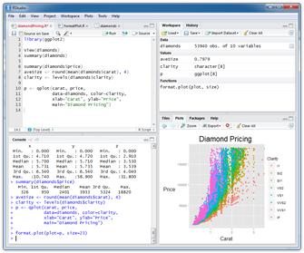
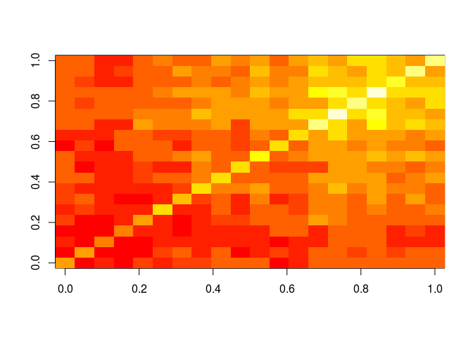

<!--
%% \VignetteEngine{knitr::rmarkdown}
%\VignetteIndexEntry{Overview Vignette}
%% \VignetteDepends{methods}
%% \VignetteKeywords{compute cluster, pipeline, reports}
%% \VignettePackage{longevityTools}
-->

<!---
- Compile from command-line
echo "rmarkdown::render('Programming_in_R.Rmd', clean=F)" | R -slave; R CMD Stangle Programming_in_R.Rmd; Rscript ../md2jekyll.R Programming_in_R.knit.md 9

- Commit to github
git commit -am "some edits"; git push -u origin master

- To customize font size and other style features, add this line to output section in preamble:  
    css: style.css
-->

<script type="text/javascript">
document.addEventListener("DOMContentLoaded", function() {
  document.querySelector("h1").className = "title";
});
</script>
<script type="text/javascript">
document.addEventListener("DOMContentLoaded", function() {
  var links = document.links;  
  for (var i = 0, linksLength = links.length; i < linksLength; i++)
    if (links[i].hostname != window.location.hostname)
      links[i].target = '_blank';
});
</script>


# Overview

One of the main attractions of using the R
([http://cran.at.r-project.org](http://cran.at.r-project.org)) environment is
the ease with which users can write their own programs and custom functions.
The R programming syntax is extremely easy to learn, even for users with no
previous programming experience. Once the basic R programming control
structures are understood, users can use the R language as a powerful
environment to perform complex custom analyses of almost any type of data [@Gentleman2008-xo].


## Why Programming in R?

* Powerful statistical environment and programming language
* Facilitates reproducible research
* Efficient data structures make programming very easy
* Ease of implementing custom functions
* Powerful graphics
* Access to fast growing number of analysis packages
* Most widely used language in bioinformatics
* Is standard for data mining and biostatistical analysis
* Technical advantages: free, open-source, available for all OSs


## R Basics 

The previous [Rbasics](http://girke.bioinformatics.ucr.edu/GEN242/mydoc/mydoc_Rbasics_01.html) tutorial provides a general introduction to the usage of the R environment and its basic command syntax.
More details can be found in the R & BioConductor manual [here](http://manuals.bioinformatics.ucr.edu/home/R_BioCondManual).

## Code Editors for R

Several excellent code editors are available that provide functionalities like R syntax highlighting, auto code indenting and utilities to send code/functions to the R console.

* [RStudio](https://www.rstudio.com/products/rstudio/features/): GUI-based IDE for R
* [Vim-R-Tmux](http://manuals.bioinformatics.ucr.edu/home/programming-in-r/vim-r): R working environment based on vim and tmux
* [Emacs](http://www.xemacs.org/Download/index.html) ([ESS add-on package](http://ess.r-project.org/))
* [gedit](https://wiki.gnome.org/Apps/Gedit) and [Rgedit](https://wiki.gnome.org/Apps/Gedit)
* [RKWard](https://rkward.kde.org/)
* [Eclipse](http://www.walware.de/goto/statet)
* [Tinn-R](http://jekyll.math.byuh.edu/other/howto/tinnr/install.shtml)
* [Notepad++ (NppToR)](https://sourceforge.net/projects/npptor/)

<center>Programming in R using RStudio</center>
<center></center>

<center> Programming in R using Vim or Emacs</center>
<center></center>

## Finding Help

Reference list on R programming (selection)

* [Advanced R](http://adv-r.had.co.nz/), by Hadley Wickham
* [R Programming for Bioinformatics](http://master.bioconductor.org/help/publications/books/r-programming-for-bioinformatics/), by Robert Gentleman
* [S Programming](http://www.stats.ox.ac.uk/pub/MASS3/Sprog/), by W. N. Venables and B. D. Ripley
* [Programming with Data](http://www.amazon.com/Programming-Data-Language-Lecture-Economics/dp/0387985034), by John M. Chambers
* [R Help](http://www1.maths.lth.se/help/R/) & [R Coding Conventions](http://www1.maths.lth.se/help/R/RCC/), Henrik Bengtsson, Lund University
* [Programming in R](http://zoonek2.free.fr/UNIX/48_R/02.html) (Vincent Zoonekynd)
* [Peter's R Programming Pages](http://www2.warwick.ac.uk/fac/sci/moac/people/students/peter_cock/r), University of Warwick
* [Rtips](http://pj.freefaculty.org/R/statsRus.html), Paul Johnsson, University of Kansas
* [R for Programmers](http://heather.cs.ucdavis.edu/~matloff/r.html), Norm Matloff, UC Davis
* [High-Performance R](http://www.statistik.uni-dortmund.de/useR-2008/tutorials/useR2008introhighperfR.pdf), Dirk Eddelbuettel tutorial presented at useR-2008
* [C/C++ level programming for R](http://www.stat.harvard.edu/ccr2005/index.html), Gopi Goswami


# Control Structures

## Important Operators

### Comparison operators

* `==` (equal)
* `!=` (not equal)
* `>` (greater than)
* `>=` (greater than or equal)
* `<` (less than)
* `<=` (less than or equal)

### Logical operators
		
* `&` (and)
* `|` (or) 
* `!` (not)

## Conditional Executions: `if` Statements

An `if` statement operates on length-one logical vectors.

__Syntax__

```r
if(TRUE) { 
	statements_1 
} else { 
	statements_2 
}
```

__Example__

```r
if(1==0) { 
	print(1) 
} else { 
	print(2) 
}
```

```
## [1] 2
```

## Conditional Executions: `ifelse` Statements

The `ifelse` statement operates on vectors.

__Syntax__

```r
ifelse(test, true_value, false_value)
```
__Example__

```r
x <- 1:10 
ifelse(x<5, x, 0)
```

```
##  [1] 1 2 3 4 0 0 0 0 0 0
```

# Loops

## `for` loop

`for` loops iterate over elements of a looping vector.

__Syntax__

```r
for(variable in sequence) { 
	statements 
}
```
__Example__

```r
mydf <- iris
myve <- NULL
for(i in seq(along=mydf[,1])) {
	myve <- c(myve, mean(as.numeric(mydf[i,1:3])))
}
myve[1:8]
```

```
## [1] 3.333333 3.100000 3.066667 3.066667 3.333333 3.666667 3.133333 3.300000
```

__Note:__ Inject into objecs is much faster than append approach with `c`, `cbind`, etc.

__Example__

```r
myve <- numeric(length(mydf[,1]))
for(i in seq(along=myve)) {
	myve[i] <- mean(as.numeric(mydf[i,1:3]))
}
myve[1:8]
```

```
## [1] 3.333333 3.100000 3.066667 3.066667 3.333333 3.666667 3.133333 3.300000
```

### Conditional Stop of Loops

The `stop` function can be used to break out of a loop (or a function) when a condition becomes `TRUE`. In addition, an error message will be printed.

__Example__

```r
x <- 1:10
z <- NULL
for(i in seq(along=x)) { 
	if(x[i] < 5) { 
		z <- c(z, x[i]-1)  
	} else { 
		stop("values need to be < 5") 
	}
}
```

## `while` loop

Iterates as long as a condition is true.

__Syntax__

```r
while(condition) {
	statements
}
```

__Example__

```r
z <- 0
while(z<5) { 
	z <- z + 2
	print(z)  
}
```

```
## [1] 2
## [1] 4
## [1] 6
```

## The `apply` Function Family

### `apply`

__Syntax__

```r
apply(X, MARGIN, FUN, ARGs)
```

__Arguments__

* `X`: `array`, `matrix` or `data.frame`
* `MARGIN`: `1` for rows, `2` for columns
* `FUN`: one or more functions
* `ARGs`: possible arguments for functions

__Example__

```r
apply(iris[1:8,1:3], 1, mean)
```

```
##        1        2        3        4        5        6        7        8 
## 3.333333 3.100000 3.066667 3.066667 3.333333 3.666667 3.133333 3.300000
```

### `tapply`

Applies a function to vector components that are defined by a factor.

__Syntax__

```r
tapply(vector, factor, FUN)
```

__Example__

```r
iris[1:2,]
```

```
##   Sepal.Length Sepal.Width Petal.Length Petal.Width Species
## 1          5.1         3.5          1.4         0.2  setosa
## 2          4.9         3.0          1.4         0.2  setosa
```

```r
tapply(iris$Sepal.Length, iris$Species, mean)
```

```
##     setosa versicolor  virginica 
##      5.006      5.936      6.588
```

### `sapply` and `lapply`

Both apply a function to vector or list objects. The `lapply` function always returns a list object, while `sapply` returns `vector` or `matrix` objects when it is possible. 

__Examples__

```r
x <- list(a = 1:10, beta = exp(-3:3), logic = c(TRUE,FALSE,FALSE,TRUE))
lapply(x, mean)
```

```
## $a
## [1] 5.5
## 
## $beta
## [1] 4.535125
## 
## $logic
## [1] 0.5
```

```r
sapply(x, mean)
```

```
##        a     beta    logic 
## 5.500000 4.535125 0.500000
```

Often used in combination with a function definition:

```r
lapply(names(x), function(x) mean(x))
sapply(names(x), function(x) mean(x))
```

# Functions

## Function Overview

A very useful feature of the R environment is the possibility to expand existing functions and to easily write custom functions. In fact, most of the R software can be viewed as a series of R functions.

__Syntax__ to define function

```r
myfct <- function(arg1, arg2, ...) { 
	function_body 
}
```
__Syntax__ to call functions

```r
myfct(arg1=..., arg2=...)
```
The value returned by a function is the value of the function body, which is usually an unassigned final expression, _e.g._: `return()`

## Function Syntax Rules
	
__General__

* Functions are defined by 
    1. The assignment with the keyword `function`
    2. The declaration of arguments/variables (`arg1, arg2, ...`) 
    3. The definition of operations (`function_body`) that perform computations on the provided arguments. A function name needs to be assigned to call the function.

__Naming__ 

* Function names can be almost anything. However, the usage of names of existing functions should be avoided.
	
__Arguments__ 

* It is often useful to provide default values for arguments (_e.g._: `arg1=1:10`). This way they don't need to be provided in a function call. The argument list can also be left empty (`myfct <- function() { fct_body }`) if a function is expected to return always the same value(s). The argument `...` can be used to allow one function to pass on argument settings to another.

__Body__

* The actual expressions (commands/operations) are defined in the function body which should be enclosed by braces. The individual commands are separated by semicolons or new lines (preferred).

__Usage__ 

* Functions are called by their name followed by parentheses containing possible argument names. Empty parenthesis after the function name will result in an error message when a function requires certain arguments to be provided by the user. The function name alone will print the definition of a function.

__Scope__

* Variables created inside a function exist only for the life time of a function. Thus, they are not accessible outside of the function. To force variables in functions to exist globally, one can use the double assignment operator: `<<-` 

## Examples

__Define sample function__


```r
myfct <- function(x1, x2=5) { 
	z1 <- x1 / x1
	z2 <- x2 * x2
        myvec <- c(z1, z2) 
        return(myvec)
} 
```

__Function usage__


Apply function to values `2` and `5`

```r
myfct(x1=2, x2=5) 
```

```
## [1]  1 25
```

Run without argument names

```r
myfct(2, 5) 
```

```
## [1]  1 25
```

Makes use of default value `5`

```r
myfct(x1=2) 
```

```
## [1]  1 25
```
Print function definition (often unintended) 

```r
myfct 
```

```
## function(x1, x2=5) { 
## 	z1 <- x1 / x1
## 	z2 <- x2 * x2
##         myvec <- c(z1, z2) 
##         return(myvec)
## }
```

# Useful Utilities

## Debugging Utilities

Several debugging utilities are available for R. They include:

* `traceback`
* `browser`
* `options(error=recover)`
* `options(error=NULL)`
* `debug`

The [Debugging in R page](http://www.stats.uwo.ca/faculty/murdoch/software/debuggingR/) provides an overview of the available resources.

## Regular Expressions

R's regular expression utilities work similar as in other languages. To learn how to use them in R, one can consult the main help page on this topic with `?regexp`.

### String matching with `grep`

The grep function can be used for finding patterns in strings, here letter `A` in vector `month.name`.

```r
month.name[grep("A", month.name)] 
```

```
## [1] "April"  "August"
```

### String substitution with `gsub`

Example for using regular expressions to substitute a pattern by another one using a back reference. Remember: single escapes `\` need to be double escaped `\\` in R.


```r
gsub('(i.*a)', 'xxx_\\1', "virginica", perl = TRUE) 
```

```
## [1] "vxxx_irginica"
```

## Interpreting a Character String as Expression

Some useful examples

Generates vector of object names in session

```r
mylist <- ls()
mylist[1] 
```

```
## [1] "i"
```

Executes 1st entry as expression


```r
get(mylist[1])
```

```
## [1] 150
```

Alternative approach 

```r
eval(parse(text=mylist[1])) 
```

```
## [1] 150
```

## Replacement, Split and Paste Functions for Strings

__Selected examples__

Substitution with back reference which inserts in this example `_` character

```r
x <- gsub("(a)","\\1_", month.name[1], perl=T) 
x
```

```
## [1] "Ja_nua_ry"
```

Split string on inserted character from above

```r
strsplit(x,"_")
```

```
## [[1]]
## [1] "Ja"  "nua" "ry"
```

Reverse a character string by splitting first all characters into vector fields


```r
paste(rev(unlist(strsplit(x, NULL))), collapse="") 
```

```
## [1] "yr_aun_aJ"
```

## Time, Date and Sleep

__Selected examples__

Return CPU (and other) times that an expression used (here ls)

```r
system.time(ls()) 
```

```
##    user  system elapsed 
##       0       0       0
```

Return the current system date and time

```r
date() 
```

```
## [1] "Wed Apr 13 16:06:06 2016"
```

Pause execution of R expressions for a given number of seconds (e.g. in loop)

```r
Sys.sleep(1) 
```

### Example

#### Import of Specific File Lines with Regular Expression

The following example demonstrates the retrieval of specific lines from an external file with a regular expression. First, an external file is created with the `cat` function, all lines of this file are imported into a vector with `readLines`, the specific elements (lines) are then retieved with the `grep` function, and the resulting lines are split into vector fields with `strsplit`.


```r
cat(month.name, file="zzz.txt", sep="\n")
x <- readLines("zzz.txt")
x[1:6] 
```

```
## [1] "January"  "February" "March"    "April"    "May"      "June"
```

```r
x <- x[c(grep("^J", as.character(x), perl = TRUE))]
t(as.data.frame(strsplit(x, "u")))
```

```
##                 [,1]  [,2] 
## c..Jan....ary.. "Jan" "ary"
## c..J....ne..    "J"   "ne" 
## c..J....ly..    "J"   "ly"
```
## Calling External Software

External command-line software can be called with `system`. The following example calls `blastall` from R

```r
system("blastall -p blastp -i seq.fasta -d uniprot -o seq.blastp")
```

# Running R Scripts

## Possibilities for Executing R Scripts

### R console

```r
source("my_script.R")
```

### Command-line


```sh
Rscript my_script.R # or just ./myscript.R after making it executable
R CMD BATCH my_script.R # Alternative way 1 
R --slave < my_script.R # Alternative way 2
```
### Passing arguments from command-line to R

Create an R script named `test.R` with the following content:


```sh
myarg <- commandArgs()
print(iris[1:myarg[6], ])
```

Then run it from the command-line like this:

```sh
Rscript test.R 10
```

In the given example the number `10` is passed on from the command-line as an argument to the R script which is used to return to `STDOUT` the first 10 rows of the `iris` sample data. If several arguments are provided, they will be interpreted as one string and need to be split in R with the strsplit function. A more detailed example can be found [here](http://manuals.bioinformatics.ucr.edu/home/ht-seq\#TOC-Quality-Reports-of-FASTQ-Files-).

# Building R Packages

## Short Overview of Package Building Process

R packages can be built with the `package.skeleton` function. The given example will create a directory named `mypackage` containing the skeleton of the package for all functions, methods and classes defined in the R script(s) passed on to the `code_files` argument. The basic structure of the package directory is described [here](http://manuals.bioinformatics.ucr.edu/home/programming-in-r#Progr_pack). The package directory will also contain a file named `Read-and-delete-me` with instructions for completing the package:


```r
package.skeleton(name="mypackage", code_files=c("script1.R", "script2.R"))
```

Once a package skeleton is available one can build the package from the command-line (Linux/OS X). This will create a tarball of the package with its version number encoded in the file name. Subequently, the package tarball needs to be checked for errors with:


```r
R CMD build mypackage
R CMD check mypackage_1.0.tar.gz
```

Install package from source

```r
install.packages("mypackage_1.0.tar.gz", repos=NULL) 
```

For more details see [here](http://manuals.bioinformatics.ucr.edu/home/programming-in-r#TOC-Building-R-Packages)

# Programming Exercises

## Exercise 1

### `for` loop

__Task 1.1__: Compute the mean of each row in `myMA` by applying the mean function in a `for` loop.


```r
myMA <- matrix(rnorm(500), 100, 5, dimnames=list(1:100, paste("C", 1:5, sep="")))
myve_for <- NULL
for(i in seq(along=myMA[,1])) {
	myve_for <- c(myve_for, mean(as.numeric(myMA[i, ])))
}
myResult <- cbind(myMA, mean_for=myve_for)
myResult[1:4, ]
```

```
##           C1         C2         C3          C4         C5   mean_for
## 1 -0.9832766  0.8446066  0.4196481  0.23814667  0.3493797  0.1737009
## 2  1.2980835  0.6924483  0.5996748 -0.51642965  0.6701380  0.5487830
## 3 -1.1466949  0.6752775 -0.9384848  0.07464206 -0.7651351 -0.4200791
## 4  0.8122978 -1.3107710  0.6664631  0.12316103 -0.1726270  0.0237048
```

### `while` loop

__Task 1.2__: Compute the mean of each row in `myMA` by applying the mean function in a `while` loop.


```r
z <- 1
myve_while <- NULL
while(z <= length(myMA[,1])) {
	myve_while <- c(myve_while, mean(as.numeric(myMA[z, ])))
	z <- z + 1
}
myResult <- cbind(myMA, mean_for=myve_for, mean_while=myve_while)
myResult[1:4, -c(1,2)]
```

```
##           C3          C4         C5   mean_for mean_while
## 1  0.4196481  0.23814667  0.3493797  0.1737009  0.1737009
## 2  0.5996748 -0.51642965  0.6701380  0.5487830  0.5487830
## 3 -0.9384848  0.07464206 -0.7651351 -0.4200791 -0.4200791
## 4  0.6664631  0.12316103 -0.1726270  0.0237048  0.0237048
```
__Task 1.3__: Confirm that the results from both mean calculations are identical

```r
all(myResult[,6] == myResult[,7])
```

```
## [1] TRUE
```

### `apply` loop
	
__Task 1.4__: Compute the mean of each row in myMA by applying the mean function in an `apply` loop

```r
myve_apply <- apply(myMA, 1, mean)
myResult <- cbind(myMA, mean_for=myve_for, mean_while=myve_while, mean_apply=myve_apply)
myResult[1:4, -c(1,2)]
```

```
##           C3          C4         C5   mean_for mean_while mean_apply
## 1  0.4196481  0.23814667  0.3493797  0.1737009  0.1737009  0.1737009
## 2  0.5996748 -0.51642965  0.6701380  0.5487830  0.5487830  0.5487830
## 3 -0.9384848  0.07464206 -0.7651351 -0.4200791 -0.4200791 -0.4200791
## 4  0.6664631  0.12316103 -0.1726270  0.0237048  0.0237048  0.0237048
```

### Avoiding loops

__Task 1.5__: When operating on large data sets it is much faster to use the rowMeans function


```r
mymean <- rowMeans(myMA)
myResult <- cbind(myMA, mean_for=myve_for, mean_while=myve_while, mean_apply=myve_apply, mean_int=mymean)
myResult[1:4, -c(1,2,3)]
```

```
##            C4         C5   mean_for mean_while mean_apply   mean_int
## 1  0.23814667  0.3493797  0.1737009  0.1737009  0.1737009  0.1737009
## 2 -0.51642965  0.6701380  0.5487830  0.5487830  0.5487830  0.5487830
## 3  0.07464206 -0.7651351 -0.4200791 -0.4200791 -0.4200791 -0.4200791
## 4  0.12316103 -0.1726270  0.0237048  0.0237048  0.0237048  0.0237048
```

## Exercise 2 

### Custom functions

__Task 2.1__: Use the following code as basis to implement a function that allows the user to compute the mean for any combination of columns in a matrix or data frame. The first argument of this function should specify the input data set, the second the mathematical function to be passed on (_e.g._ `mean`, `sd`, `max`) and the third one should allow the selection of the columns by providing a grouping vector.


```r
myMA <- matrix(rnorm(100000), 10000, 10, dimnames=list(1:10000, paste("C", 1:10, sep="")))
myMA[1:2,]
```

```
##           C1         C2         C3        C4         C5        C6         C7         C8         C9
## 1 0.17958477 -0.5714262 -0.8866647  2.463907 -0.8126814 -0.933438 -0.8118745 -0.5546591 -0.9026947
## 2 0.04191538  1.2456075  0.4953736 -2.703100  0.2055566 -1.945671 -2.8696620 -1.5043589 -1.8783809
##          C10
## 1 -0.5698361
## 2 -1.6321152
```

```r
myList <- tapply(colnames(myMA), c(1,1,1,2,2,2,3,3,4,4), list) 
names(myList) <- sapply(myList, paste, collapse="_")
myMAmean <- sapply(myList, function(x) apply(myMA[,x], 1, mean))
myMAmean[1:4,] 
```

```
##     C1_C2_C3   C4_C5_C6      C7_C8     C9_C10
## 1 -0.4261687  0.2392626 -0.6832668 -0.7362654
## 2  0.5942988 -1.4810715 -2.1870104 -1.7552480
## 3  0.1217488 -0.7225502 -0.6295343  0.4990018
## 4 -0.9118941 -0.3107419  0.3284317 -0.5693107
```
<!---
Solution

-->


## Exercise 3

### Nested loops to generate similarity matrices

__Task 3.1__: Create a sample list populated with character vectors of different lengths


```r
setlist <- lapply(11:30, function(x) sample(letters, x, replace=TRUE))
names(setlist) <- paste("S", seq(along=setlist), sep="") 
setlist[1:6]
```

```
## $S1
##  [1] "x" "r" "j" "n" "l" "z" "b" "o" "v" "j" "i"
## 
## $S2
##  [1] "k" "b" "p" "c" "z" "f" "v" "u" "e" "d" "c" "f"
## 
## $S3
##  [1] "l" "e" "p" "j" "i" "k" "y" "i" "w" "l" "w" "x" "p"
## 
## $S4
##  [1] "d" "e" "v" "o" "h" "q" "i" "e" "d" "y" "o" "m" "q" "y"
## 
## $S5
##  [1] "s" "q" "r" "j" "o" "z" "q" "g" "s" "v" "w" "j" "l" "r" "d"
## 
## $S6
##  [1] "c" "l" "h" "v" "e" "a" "i" "u" "g" "h" "s" "f" "u" "b" "e" "y"
```

__Task 3.2__: Compute the length for all pairwise intersects of the vectors stored in `setlist`. The intersects can be determined with the `%in%` function like this: `sum(setlist[[1]] %in% setlist[[2]])`


```r
setlist <- sapply(setlist, unique)
olMA <- sapply(names(setlist), function(x) sapply(names(setlist), 
               function(y) sum(setlist[[x]] %in% setlist[[y]])))
olMA[1:12,] 
```

```
##     S1 S2 S3 S4 S5 S6 S7 S8 S9 S10 S11 S12 S13 S14 S15 S16 S17 S18 S19 S20
## S1  10  3  4  3  6  4  6  6  7   8   7   2   5   8   8   8   8   7   8   7
## S2   3 10  3  3  3  6  7  4  7   2   5   6   4   8   7   6   8   6   7   7
## S3   4  3  9  3  3  4  4  5  4   5   5   3   4   5   7   7   8   5   5   5
## S4   3  3  3  9  4  5  3  4  5   5   5   7   7   5   8   7   7   5   6   5
## S5   6  3  3  4 11  4  3  5  6   6   7   7   8  10   9   8   8   7   8   8
## S6   4  6  4  5  4 13  4  5  7   5   7   8   6   9   9   8   9   7   7   9
## S7   6  7  4  3  3  4 12  6  7   5   9   4   6   9   9   8  10   8  10   8
## S8   6  4  5  4  5  5  6 13  9   9  10   7   7   9  12   9  11   9   9   7
## S9   7  7  4  5  6  7  7  9 14   7   8   7   7  11  11  10  11   8   9  11
## S10  8  2  5  5  6  5  5  9  7  13   8   6   6   6  10  11   9   9   8   9
## S11  7  5  5  5  7  7  9 10  8   8  15   7   9  11  11  10  12  11  12  10
## S12  2  6  3  7  7  8  4  7  7   6   7  14   8  10  11   9  11   9   9   8
```
__Task 3.3__ Plot the resulting intersect matrix as heat map. The `image` or the `heatmap.2` function from the `gplots` library can be used for this.

```r
image(olMA)
```

\

## Exercise 4

### Build your own R package

__Task 4.1__: Save one or more of your functions to a file called `script.R` and build the package with the `package.skeleton` function.


```r
package.skeleton(name="mypackage", code_files=c("script1.R"), namespace=TRUE)
```

__Task 4.2__: Build tarball of the package


```r
system("R CMD build mypackage")
```

__Task 4.3__: Install and use package


```r
install.packages("mypackage_1.0.tar.gz", repos=NULL, type="source")
library(mypackage)
?myMAcomp # Opens help for function defined by mypackage
```

# Homework 5

## Reverse and complement of DNA

__Task 1__: Write a `RevComp` function that returns the reverse and complement of a DNA sequence string. Include an argument that will allow to return only the reversed sequence, the complemented sequence or the reversed and complemented sequence. The following R functions will be useful for the implementation: 


```r
x <- c("ATGCATTGGACGTTAG")  
x
```

```
## [1] "ATGCATTGGACGTTAG"
```

```r
x <- substring(x, 1:nchar(x), 1:nchar(x)) 
x
```

```
##  [1] "A" "T" "G" "C" "A" "T" "T" "G" "G" "A" "C" "G" "T" "T" "A" "G"
```

```r
x <- rev(x) 
x
```

```
##  [1] "G" "A" "T" "T" "G" "C" "A" "G" "G" "T" "T" "A" "C" "G" "T" "A"
```

```r
x <- paste(x, collapse="")
x
```

```
## [1] "GATTGCAGGTTACGTA"
```

```r
chartr("ATGC", "TACG", x) 
```

```
## [1] "CTAACGTCCAATGCAT"
```

__Task 2__: Write a function that applies the `RevComp` function to many sequences stored in a vector.

## Translate DNA into Protein

__Task 3__: Write a function that will translate one or many DNA sequences in all three reading frames into proteins. The following commands will simplify this task:


```r
AAdf <- read.table(file="http://faculty.ucr.edu/~tgirke/Documents/R_BioCond/My_R_Scripts/AA.txt", header=TRUE, sep="\t") 
AAdf[1:4,]
```

```
##   Codon AA_1 AA_3 AA_Full AntiCodon
## 1   TCA    S  Ser  Serine       TGA
## 2   TCG    S  Ser  Serine       CGA
## 3   TCC    S  Ser  Serine       GGA
## 4   TCT    S  Ser  Serine       AGA
```

```r
AAv <- as.character(AAdf[,2]) 
names(AAv) <- AAdf[,1] 
AAv
```

```
## TCA TCG TCC TCT TTT TTC TTA TTG TAT TAC TAA TAG TGT TGC TGA TGG CTA CTG CTC CTT CCA CCG CCC CCT CAT 
## "S" "S" "S" "S" "F" "F" "L" "L" "Y" "Y" "*" "*" "C" "C" "*" "W" "L" "L" "L" "L" "P" "P" "P" "P" "H" 
## CAC CAA CAG CGA CGG CGC CGT ATT ATC ATA ATG ACA ACG ACC ACT AAT AAC AAA AAG AGT AGC AGA AGG GTA GTG 
## "H" "Q" "Q" "R" "R" "R" "R" "I" "I" "I" "M" "T" "T" "T" "T" "N" "N" "K" "K" "S" "S" "R" "R" "V" "V" 
## GTC GTT GCA GCG GCC GCT GAT GAC GAA GAG GGA GGG GGC GGT 
## "V" "V" "A" "A" "A" "A" "D" "D" "E" "E" "G" "G" "G" "G"
```

```r
y <- gsub("(...)", "\\1_", x) 
y <- unlist(strsplit(y, "_")) 
y <- y[grep("^...$", y)] 
AAv[y] 
```

```
## GAT TGC AGG TTA CGT 
## "D" "C" "R" "L" "R"
```

## Homework submission
Submit the 3 functions in one well structured and annotated R script to the instructor. The script should include instructions on how to use the functions.

## Due date

This homework is due on Thu, April 21th at 6:00 PM.

## Homework Solutions

See [here](https://drive.google.com/file/d/0B-lLYVUOliJFWlBhb2xNOWdfS0U/view?usp=sharing)


# Session Info


```r
sessionInfo()
```

```
## R version 3.2.4 Revised (2016-03-16 r70336)
## Platform: x86_64-pc-linux-gnu (64-bit)
## Running under: Ubuntu 14.04.4 LTS
## 
## locale:
##  [1] LC_CTYPE=en_US.UTF-8       LC_NUMERIC=C               LC_TIME=en_US.UTF-8       
##  [4] LC_COLLATE=en_US.UTF-8     LC_MONETARY=en_US.UTF-8    LC_MESSAGES=en_US.UTF-8   
##  [7] LC_PAPER=en_US.UTF-8       LC_NAME=C                  LC_ADDRESS=C              
## [10] LC_TELEPHONE=C             LC_MEASUREMENT=en_US.UTF-8 LC_IDENTIFICATION=C       
## 
## attached base packages:
## [1] stats     graphics  utils     datasets  grDevices methods   base     
## 
## other attached packages:
## [1] ggplot2_2.0.0   limma_3.26.3    BiocStyle_1.8.0
## 
## loaded via a namespace (and not attached):
##  [1] Rcpp_0.12.3      codetools_0.2-14 digest_0.6.9     plyr_1.8.3       grid_3.2.4      
##  [6] gtable_0.1.2     formatR_1.2.1    magrittr_1.5     evaluate_0.8     scales_0.3.0    
## [11] stringi_1.0-1    rmarkdown_0.9.2  tools_3.2.4      stringr_1.0.0    munsell_0.4.2   
## [16] yaml_2.1.13      colorspace_1.2-6 htmltools_0.3    knitr_1.12
```

# References

